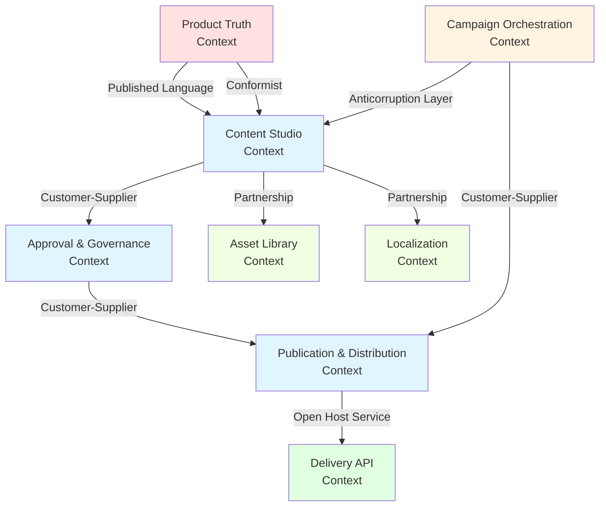
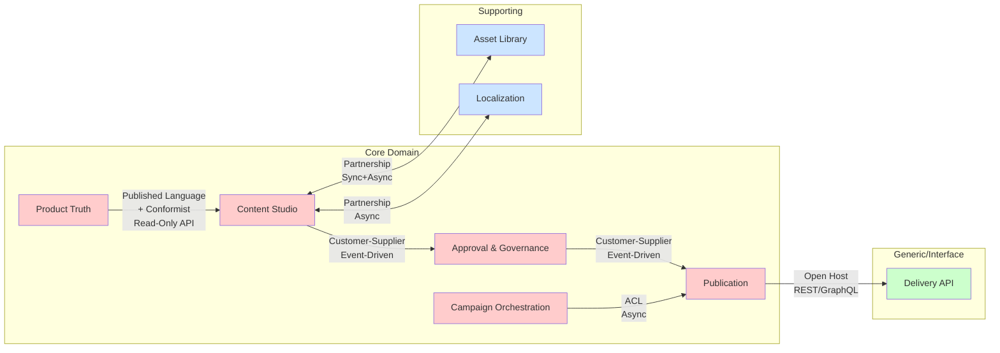
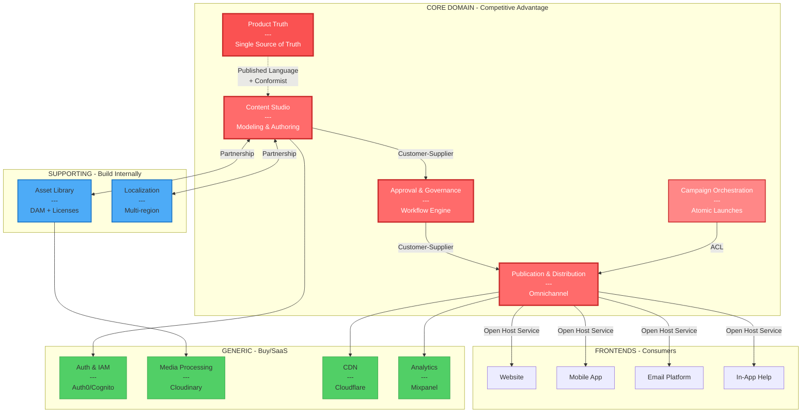

# Analiza Strategic DDD: System Zarządzania Treścią (CMS)

## 1. Klasyfikacja Subdomen

| Subdomena | Typ | Złożoność | Zmienność | Priorytet | Uzasadnienie Biznesowe |
|-----------|-----|-----------|-----------|-----------|------------------------|
| **Content Modeling & Authoring** | **CORE** | High | Medium | 1 | Unikalny sposób strukturyzacji treści jako "data assets" to fundament przewagi konkurencyjnej. Zdolność do definiowania elastycznych modeli treści i komponentów bezpośrednio wpływa na szybkość wprowadzania innowacji w komunikacji. |
| **Omnichannel Distribution** | **CORE** | High | High | 1 | Headless API jako centralny hub contentu dla całej organizacji to kluczowa capability wyróżniająca na rynku. Umożliwia dostarczanie spójnych doświadczeń we wszystkich punktach kontaktu z klientem. |
| **Editorial Workflow & Governance** | **CORE** | High | Medium | 2 | Ustrukturyzowane procesy akceptacji z pełnym audytem to nie tylko compliance - to przewaga operacyjna. Zdolność do zarządzania złożonymi przepływami (prawne, produkt, marketing) w sposób transparentny i mierzalny wyróżnia firmę. |
| **Digital Asset Management** | **SUPPORTING** | Medium | Low | 3 | Niezbędne do funkcjonowania, ale nie unikalne. Zarządzanie prawami autorskimi i licencjami jest krytyczne dla bezpieczeństwa prawnego, ale nie daje przewagi konkurencyjnej. Możliwe do zbudowania lub integracji z zewnętrznym rozwiązaniem. |
| **Multi-language & Localization** | **SUPPORTING** | Medium | Medium | 2 | Kluczowe dla ekspansji międzynarodowej, ale operacyjne, nie strategiczne. Mechanizmy dziedziczenia globalnych wartości z lokalnymi nadpisaniami są złożone technicznie, ale nie unikalne rynkowo. |
| **Search & Indexing** | **SUPPORTING** | Medium | Low | 4 | Niezbędne dla użyteczności systemu, ale commodity na poziomie technologii. Można wykorzystać gotowe rozwiązania (Elasticsearch, Algolia). |
| **Authentication & Authorization** | **GENERIC** | Low | Low | 3 | Standardowy problem bezpieczeństwa. **Rekomendacja:** Auth0, AWS Cognito, lub Keycloak jako gotowe rozwiązania. |
| **Media Processing** | **GENERIC** | Low | Low | 4 | Transformacje obrazów, video encoding - commodity. **Rekomendacja:** Cloudinary, Imgix, AWS MediaConvert. |
| **Content Delivery (CDN)** | **GENERIC** | Low | Low | 5 | Infrastruktura dostępna jako usługa. **Rekomendacja:** Cloudflare, Fastly, AWS CloudFront. |
| **Analytics & Reporting** | **GENERIC** | Low | Medium | 5 | Standardowe narzędzia analityczne. **Rekomendacja:** Google Analytics, Mixpanel, Amplitude dla trackingu user behavior. |

### Kluczowe Obserwacje:

**⚠️ Obszary wymagające największej uwagi:**
- **Content Modeling** - To jest DNA systemu. Złe decyzje tutaj są trudne do cofnięcia później.
- **Workflow Engine** - Musi być wystarczająco elastyczny, aby wspierać różne procesy, ale nie może być "programowalny" przez użytkowników (ryzyko chaosu).

**💡 Quick Wins:**
- Większość generic subdomen można rozwiązać przez integrację z SaaS, co pozwoli skupić zasoby na Core.

## 2. Identyfikacja Bounded Contexts

### 2.1 Content Studio Context

**Boundaries:** Od pomysłu na treść przez kreację i współpracę, po finalną wersję gotową do publikacji.

**Ubiquitous Language:**
- `Content Model` - schemat struktury treści (np. BlogPost, Product, CaseStudy)
- `Content Item` - konkretna instancja treści
- `Component` - reużywalny element UI z własnymi danymi
- `Draft` - wersja robocza treści
- `Revision` - historyczna wersja treści
- `Comment` - komentarz w kontekście konkretnej treści lub fragmentu
- `Content Type` - typ treści definiujący dostępne pola

**Odpowiedzialności:**
- Definicja i ewolucja modeli treści (Content Models)
- WYSIWYG/strukturalny interfejs edycji
- Zarządzanie wersjami i revisjami
- Współpraca w czasie rzeczywistym (komentarze, sugestie)
- Walidacja strukturalna treści przed publikacją

**Powiązanie z subdomenami:** Content Modeling & Authoring (Core), częściowo DAM (Supporting)

**Autonomia:** **High** - Może funkcjonować niezależnie, ma własny lifecycle treści.

---

### 2.2 Approval & Governance Context

**Boundaries:** Od momentu, gdy treść jest "gotowa" do momentu otrzymania wszystkich wymaganych akceptacji.

**Ubiquitous Language:**
- `Approval Workflow` - zdefiniowana ścieżka akceptacji
- `Approval Stage` - etap w workflow wymagający decyzji
- `Approver` - rola uprawniona do zatwierdzenia na danym etapie
- `Approval Status` - stan akceptacji (Pending, Approved, Rejected, Changes Requested)
- `Audit Trail` - niemodyfikowalny log wszystkich decyzji i zmian
- `Review Request` - formalne żądanie recenzji
- `Content Freeze` - zablokowanie treści do edycji podczas procesu akceptacji

**Odpowiedzialności:**
- Orkiestracja wieloetapowych workflow akceptacji
- Zarządzanie uprawnieniami do akceptacji
- Rejestracja pełnego audit trail (kto, kiedy, dlaczego)
- Powiadomienia i eskalacje przy opóźnieniach
- Warunkowe routing (np. "jeśli treść zawiera claim medyczny → prawny")

**Powiązanie z subdomenami:** Editorial Workflow & Governance (Core)

**Autonomia:** **Medium** - Potrzebuje informacji o treści z Content Studio, ale zarządza własnym procesem.

---

### 2.3 Publication & Distribution Context

**Boundaries:** Od zaakceptowanej treści, przez mechanizmy publikacji, do dostarczenia do wszystkich kanałów.

**Ubiquitous Language:**
- `Publication` - akt udostępnienia treści
- `Publication Target` - kanał docelowy (Website, Mobile App, Email)
- `Scheduled Publication` - publikacja zaplanowana w czasie
- `Content Bundle` - transakcyjna paczka powiązanych treści (atomowość kampanii)
- `Rollback` - wycofanie publikacji
- `Preview Token` - tymczasowy dostęp do nieopublikowanej treści
- `Cache Invalidation` - wymuszenie odświeżenia treści w CDN

**Odpowiedzialności:**
- Mechanizmy publikacji (natychmiastowa, zaplanowana)
- Zapewnienie atomowości publikacji kampanii
- Zarządzanie wersjami publikowanymi
- Integracja z CDN i cache invalidation
- Generowanie preview links
- Rollback i disaster recovery

**Powiązanie z subdomenami:** Omnichannel Distribution (Core), częściowo CDN (Generic)

**Autonomia:** **High** - Własna logika publikacji, niezależna od szczegółów treści.

---

### 2.4 Asset Library Context

**Boundaries:** Zarządzanie wszystkimi zasobami binarnymi używanymi w treściach.

**Ubiquitous Language:**
- `Asset` - zasób binarny (obraz, video, dokument)
- `Asset Metadata` - dane opisowe (alt text, copyright, license)
- `Asset Collection` - tematyczna kolekcja zasobów
- `License` - informacja o prawach użytkowania
- `Expiration Date` - data wygaśnięcia praw
- `Transformation` - operacja na zasobie (crop, resize, format change)
- `Asset Version` - wersja zasobu (zastąpienie)

**Odpowiedzialności:**
- Przechowywanie i katalogowanie zasobów
- Zarządzanie prawami autorskimi i licencjami
- Tracking dat wygaśnięcia
- Integracja z procesorami mediów (transformacje)
- Wyszukiwanie i tagowanie zasobów

**Powiązanie z subdomenami:** DAM (Supporting), Media Processing (Generic)

**Autonomia:** **High** - Samodzielny bounded context z własnym modelem domeny.

---

### 2.5 Product Truth Context

**Boundaries:** Single Source of Truth dla informacji o produkcie.

**Ubiquitous Language:**
- `Product Feature` - funkcjonalność produktu
- `Feature Description` - oficjalny opis funkcji
- `Product Entity` - agregat informacji o produkcie
- `Release` - wersja produktu z przypisanymi features
- `Feature Flag` - kontrola widoczności funkcji
- `Product Taxonomy` - hierarchiczna klasyfikacja funkcji

**Odpowiedzialności:**
- Utrzymanie kanonicznej prawdy o produkcie
- Wersjonowanie opisów funkcji
- Kontrola dostępu do modyfikacji (tylko Product team)
- API dla konsumentów informacji o produkcie
- Synchronizacja z roadmapą produktu

**Powiązanie z subdomenami:** Content Modeling & Authoring (Core) - ale jako wydzielona enklawy

**Autonomia:** **High** - Musi być izolowany od "kreatywnych" zmian marketingu.

---

### 2.6 Campaign Orchestration Context

**Boundaries:** Zarządzanie kampaniami jako spójnymi jednostkami publikacji.

**Ubiquitous Language:**
- `Campaign` - koordynowana inicjatywa marketingowa
- `Campaign Asset` - treść należąca do kampanii
- `Launch Window` - okno czasowe publikacji
- `Campaign Status` - stan kampanii (Draft, Scheduled, Live, Archived)
- `Cross-channel Coordination` - synchronizacja między kanałami
- `Campaign Calendar` - harmonogram wszystkich kampanii

**Odpowiedzialności:**
- Grupowanie powiązanych treści w kampanie
- Zapewnienie atomowości publikacji kampanii
- Zarządzanie kalendarzem kampanii
- Identyfikacja konfliktów (nakładające się kampanie)
- Agregowane raportowanie efektów kampanii

**Powiązanie z subdomenami:** Editorial Workflow & Governance (Core), Omnichannel Distribution (Core)

**Autonomia:** **Medium** - Orkiestruje treści z innych kontekstów.

---

### 2.7 Localization Context

**Boundaries:** Zarządzanie tłumaczeniami i adaptacjami lokalnymi.

**Ubiquitous Language:**
- `Locale` - kontekst językowy i regionalny (pl-PL, de-DE)
- `Translation` - przetłumaczona wersja treści
- `Localized Content` - treść zaadaptowana lokalnie
- `Global Template` - szablon współdzielony między regionami
- `Local Override` - nadpisanie wartości globalnej
- `Translation Status` - stan tłumaczenia (Missing, In Progress, Completed)
- `Translation Memory` - baza wcześniejszych tłumaczeń

**Odpowiedzialności:**
- Tracking stanu tłumaczeń
- Mechanizmy dziedziczenia z fallbackiem
- Integracja z CAT tools (Translation Management Systems)
- Zarządzanie lokalnymi nadpisaniami
- Detekcja content drift między wersjami językowymi

**Powiązanie z subdomenami:** Multi-language & Localization (Supporting)

**Autonomia:** **Medium** - Współpracuje z Content Studio, ale ma własną logikę.

---

### 2.8 Delivery API Context

**Boundaries:** Headless API dostarczające treści do frontendów.

**Ubiquitous Language:**
- `Content API` - RESTful/GraphQL endpoint
- `Content Query` - zapytanie o treść
- `Content Response` - ustrukturyzowana odpowiedź
- `API Client` - konsument API (website, mobile app, IoT)
- `Content Projection` - transformacja modelu wewnętrznego do API
- `Cache Strategy` - strategia cache'owania odpowiedzi

**Odpowiedzialności:**
- Dostarczanie treści przez API
- Transformacja modeli wewnętrznych do kontraktów API
- Zarządzanie wersjami API
- Rate limiting i security
- Optymalizacja wydajności (GraphQL, partial responses)

**Powiązanie z subdomenami:** Omnichannel Distribution (Core)

**Autonomia:** **High** - Dobrze zdefiniowane granice, niezależny deployment.

## 3. Context Mapping - Relacje między Kontekstami



### Szczegółowy Opis Relacji:

#### 3.1 Content Studio → Approval & Governance: **Customer-Supplier**

**Upstream:** Content Studio
**Downstream:** Approval & Governance

**Opis:**
Content Studio dostarcza "gotowe" treści do procesu akceptacji. Approval Context może wpływać na roadmap Content Studio (np. żądanie nowych pól potrzebnych dla compliance).

**Integracja:**
- Content Studio publikuje event: `ContentReadyForApproval`
- Approval Context subskrybuje i inicjuje workflow
- Zwrotna komunikacja przez: `ApprovalStatusChanged` events

**Implikacje techniczne:**
- Asynchroniczna komunikacja przez message bus (Event-Driven)
- Content Studio musi ekspozować API do pobierania szczegółów treści
- Eventual consistency - treść może być w trakcie edycji podczas gdy approval process trwa

**Implikacje organizacyjne:**
- Teams muszą współpracować przy definiowaniu kontraktu events
- Content Studio team ma wpływ na Approval team (downstream voice)

**Ryzyka:**
- Content Studio może wprowadzać breaking changes w strukturze treści
- **Mitigacja:** Versionowane events, consumer-driven contract tests

---

#### 3.2 Approval & Governance → Publication & Distribution: **Customer-Supplier**

**Upstream:** Approval & Governance
**Downstream:** Publication & Distribution

**Opis:**
Tylko zaakceptowana treść może być opublikowana. Publication Context jest "klientem" który otrzymuje sygnał o gotowości treści.

**Integracja:**
- Event: `ContentApproved` → wyzwala możliwość publikacji
- Publication Context może żądać dodatkowych informacji z Approval (audit trail)

**Implikacje techniczne:**
- Event-Driven z możliwością query dla audit trail
- Publication Context musi respektować stan akceptacji (nie może opublikować niezaakceptowanej treści)

**Implikacje organizacyjne:**
- Governance team ma wpływ na Publication team
- Współna odpowiedzialność za SLA publikacji

**Ryzyka:**
- Approval workflow może stać się bottleneckiem dla publikacji
- **Mitigacja:** SLA dla każdego etapu approval, eskalacje, możliwość "fast-track" dla low-risk content

---

#### 3.3 Content Studio ↔ Asset Library: **Partnership**

**Opis:**
Obydwa konteksty są równorzędnymi partnerami. Content Studio potrzebuje Asset Library, ale Asset Library też ewoluuje w odpowiedzi na potrzeby Content Studio.

**Integracja:**
- Dwukierunkowa komunikacja
- Content Studio embeds `AssetReference` w treściach
- Asset Library powiadamia o zmianach: `AssetUpdated`, `LicenseExpired`

**Implikacje techniczne:**
- Synchroniczna integracja dla asset browsing (API calls)
- Asynchroniczna dla powiadomień o zmianach
- Shared kernel potencjalnie dla `AssetReference` value object

**Implikacje organizacyjne:**
- Teams muszą ściśle współpracować
- Wspólny commitment do zmian (partnering teams)
- Synchronized planning cycles

**Ryzyka:**
- Tight coupling może spowolnić oba teamy
- **Mitigacja:** Dobrze zdefiniowane API boundaries, minimalizacja shared code

---

#### 3.4 Product Truth → Content Studio: **Published Language + Conformist**

**Upstream:** Product Truth
**Downstream:** Content Studio (w roli konsumenta informacji o produkcie)

**Opis:**
To jest kluczowa relacja rozwiązująca konflikt "Marketing vs Product". Product Truth publikuje kanoniczną prawdę o produkcie w ustandaryzowanym formacie (Published Language). Content Studio MUSI się tej prawdy trzymać (Conformist) - nie ma prawa jej modyfikować.

**Published Language:**
```json
{
  "productFeature": {
    "id": "uuid",
    "name": "string",
    "canonicalDescription": "string",  // NIE DO MODYFIKACJI
    "releaseDate": "date",
    "status": "beta|ga|deprecated"
  }
}
```

**Integracja:**
- Content Studio reference produkty przez `ProductFeatureReference`
- API call lub embedded data (decision: eventual vs strong consistency)
- Content Studio może dodawać "marketing flavor" ALE nie może zmieniać canonical description

**Implikacje techniczne:**
- Read-only integration dla Content Studio
- Product Truth może być synchronicznym API lub replicated read model
- Consistency model: Strong consistency dla canonical data

**Implikacje organizacyjne:**
- **To jest techniczne wymuszenie organizacyjnej hierarchii**
- Product team ma absolute authority
- Marketing team musi się dostosować (Conformist pattern)

**Ryzyka:**
- Marketing czuje się ograniczony, może próbować "obejść" system
- **Mitigacja:**
  - Jasna komunikacja biznesowa dlaczego to jest konieczne
  - Dać marketingowi "approved marketing copy" fields dla dodatkowego kontekstu
  - Product team musi być responsive na feedback

**⚠️ KRYTYCZNA DECYZJA ARCHITEKTONICZNA:**
To jest miejsce gdzie architektura wymusza behavior organizacyjny. Bez tego patternu, "bitwa o prawdę" będzie trwać w nieskończoność.

---

#### 3.5 Campaign Orchestration → Content Studio/Publication: **Anticorruption Layer**

**Opis:**
Campaign context orkiestruje wiele treści, ale nie chce być zależny od szczegółów implementacyjnych Content Studio. Używa ACL do translacji.

**Integracja:**
- Campaign Context ma własny model "CampaignAsset" (uproszczony)
- ACL tłumaczy między `CampaignAsset` a szczegółowym modelem Content Studio
- Event: `CampaignLaunched` → ACL tłumaczy na serie komend publikacji

**Implikacje techniczne:**
- Dodatkowa warstwa translacji (overhead)
- Campaign Context pozostaje stabilny mimo zmian w Content Studio

**Implikacje organizacyjne:**
- Campaign team może ewoluować niezależnie
- Wymaga dedykowanego ownera dla ACL

**Ryzyka:**
- ACL może stać się kompleksowy i trudny w maintenance
- **Mitigacja:** Keep ACL thin, regular refactoring

---

#### 3.6 Content Studio ↔ Localization: **Partnership**

**Opis:**
Podobnie jak z Asset Library - równorzędne partnerstwo. Content definiuje "co" tłumaczyć, Localization definiuje "jak" zarządzać tłumaczeniami.

**Integracja:**
- Content Studio markuje pola jako "translatable"
- Localization Context zarządza workflows tłumaczeń
- Events: `ContentPublished` → trigger translation request, `TranslationCompleted` → update content

**Implikacje techniczne:**
- Partnership wymaga tight coordination
- Potential shared kernel dla `Locale` value object

**Implikacje organizacyjne:**
- Global i Local teams muszą współpracować
- Shared planning dla international launches

**Ryzyka:**
- Bottleneck w tłumaczeniach może opóźnić globalne kampanie
- **Mitigacja:** Priorytetyzacja treści do tłumaczenia, machine translation dla low-stakes content

---

#### 3.7 Publication & Distribution → Delivery API: **Open Host Service**

**Opis:**
Publication Context eksponuje treści przez dobrze zdefiniowany, stabilny API dla wielu konsumentów (websites, mobile apps, IoT, third-party integrations).

**Integracja:**
- RESTful API lub GraphQL
- Versioned API contracts
- Multiple consumers without coupling

**Implikacje techniczne:**
- API jako first-class citizen
- API versioning strategy (semantic versioning)
- Backward compatibility guarantees

**Implikacje organizacyjne:**
- API team ma responsibility dla stability i developer experience
- Consumer feedback loop jest krytyczny

**Ryzyka:**
- Breaking changes impactują wszystkich konsumentów
- **Mitigacja:** Semantic versioning, deprecation warnings, long deprecation periods

---

### Mermaid: Context Map z Typami Relacji



## 4. Integration Patterns & Event Catalog

### 4.1 Strategie Integracji

| Relacja | Pattern | Sync/Async | Uzasadnienie | Konsystencja |
|---------|---------|------------|--------------|--------------|
| Content Studio → Approval | Event-Driven | Async | Długi czas przetwarzania approval, nie blokujemy UI | Eventual |
| Approval → Publication | Event-Driven | Async | Publication może być scheduled, nie wymaga immediate response | Eventual |
| Content Studio → Asset Library | Request-Response + Events | Sync+Async | Browse assets (sync), powiadomienia o zmianach (async) | Strong (browse), Eventual (changes) |
| Product Truth → Content Studio | Request-Response | Sync | Konieczność wyświetlania aktualnych danych o produkcie w UI | Strong |
| Publication → Delivery API | Request-Response | Sync | Real-time queries od frontendów | Strong (z cache) |
| Campaign → Publication | Command + Events | Async | Atomowa publikacja wymaga koordynacji | Eventual |

### 4.2 Bounded Context Events (Kluczowe Wydarzenia Domenowe)

#### Content Studio Context

```typescript
// Domain Events
ContentModelDefined {
  modelId: UUID
  modelName: string
  fields: Field[]
  definedBy: UserId
  timestamp: DateTime
}

ContentItemCreated {
  itemId: UUID
  contentType: string
  createdBy: UserId
  language: Locale
  timestamp: DateTime
}

ContentItemUpdated {
  itemId: UUID
  revisionId: UUID
  changes: Change[]
  updatedBy: UserId
  timestamp: DateTime
}

ContentReadyForReview {
  itemId: UUID
  requestedBy: UserId
  reviewType: ReviewType  // legal, product, marketing
  timestamp: DateTime
}

ContentRevisionCreated {
  itemId: UUID
  revisionId: UUID
  createdFrom: UUID?  // previous revision
  timestamp: DateTime
}
```

#### Approval & Governance Context

```typescript
ApprovalWorkflowStarted {
  workflowId: UUID
  contentItemId: UUID
  stages: ApprovalStage[]
  initiatedBy: UserId
  timestamp: DateTime
}

ApprovalStageCompleted {
  workflowId: UUID
  stageId: UUID
  decision: 'approved' | 'rejected' | 'changes_requested'
  approver: UserId
  comment: string?
  timestamp: DateTime
}

ContentApproved {
  contentItemId: UUID
  workflowId: UUID
  allApprovers: UserId[]
  finalApprovalTimestamp: DateTime
}

ContentRejected {
  contentItemId: UUID
  workflowId: UUID
  rejectedBy: UserId
  reason: string
  timestamp: DateTime
}

ApprovalEscalated {
  workflowId: UUID
  stageId: UUID
  reason: 'timeout' | 'manual'
  escalatedTo: UserId
  timestamp: DateTime
}
```

#### Publication & Distribution Context

```typescript
ContentPublished {
  itemId: UUID
  publicationId: UUID
  targets: PublicationTarget[]  // web, mobile, email
  publishedAt: DateTime
  publishedBy: UserId
}

ContentScheduledForPublication {
  itemId: UUID
  scheduledFor: DateTime
  targets: PublicationTarget[]
  scheduledBy: UserId
}

CampaignPublished {
  campaignId: UUID
  contentItems: UUID[]
  allPublishedSuccessfully: boolean
  publishedAt: DateTime
}

PublicationFailed {
  itemId: UUID
  target: PublicationTarget
  error: Error
  timestamp: DateTime
}

ContentUnpublished {
  itemId: UUID
  unpublishedFrom: PublicationTarget[]
  reason: string
  unpublishedBy: UserId
  timestamp: DateTime
}

CacheInvalidationRequested {
  itemId: UUID
  urls: string[]
  timestamp: DateTime
}
```

#### Asset Library Context

```typescript
AssetUploaded {
  assetId: UUID
  filename: string
  mimeType: string
  uploadedBy: UserId
  timestamp: DateTime
}

AssetMetadataUpdated {
  assetId: UUID
  metadata: AssetMetadata
  updatedBy: UserId
  timestamp: DateTime
}

AssetLicenseExpiring {
  assetId: UUID
  expiresAt: DateTime
  daysRemaining: number
  timestamp: DateTime
}

AssetLicenseExpired {
  assetId: UUID
  expiredAt: DateTime
  usedInContent: UUID[]  // content items używające tego assetu
  timestamp: DateTime
}

AssetDeleted {
  assetId: UUID
  deletedBy: UserId
  replacedWith: UUID?  // opcjonalny replacement
  timestamp: DateTime
}
```

#### Product Truth Context

```typescript
ProductFeatureAdded {
  featureId: UUID
  name: string
  canonicalDescription: string
  releaseDate: DateTime
  addedBy: UserId
  timestamp: DateTime
}

ProductFeatureUpdated {
  featureId: UUID
  changes: {
    canonicalDescription?: string
    status?: FeatureStatus
    releaseDate?: DateTime
  }
  updatedBy: UserId
  reason: string
  timestamp: DateTime
}

ProductFeatureDeprecated {
  featureId: UUID
  deprecatedAt: DateTime
  replacedBy: UUID?
  migrationGuide: string?
  timestamp: DateTime
}
```

#### Campaign Orchestration Context

```typescript
CampaignCreated {
  campaignId: UUID
  name: string
  launchWindow: TimeWindow
  createdBy: UserId
  timestamp: DateTime
}

CampaignAssetAdded {
  campaignId: UUID
  contentItemId: UUID
  assetType: 'landing_page' | 'email' | 'blog_post' | 'social'
  addedBy: UserId
  timestamp: DateTime
}

CampaignReadyForLaunch {
  campaignId: UUID
  allAssetsReady: boolean
  scheduledLaunchAt: DateTime
  timestamp: DateTime
}

CampaignLaunched {
  campaignId: UUID
  launchedAssets: UUID[]
  launchedAt: DateTime
  launchedBy: UserId
}

CampaignLaunchFailed {
  campaignId: UUID
  failedAssets: UUID[]
  errors: Error[]
  timestamp: DateTime
}
```

#### Localization Context

```typescript
TranslationRequested {
  contentItemId: UUID
  sourceLocale: Locale
  targetLocales: Locale[]
  requestedBy: UserId
  priority: 'high' | 'medium' | 'low'
  timestamp: DateTime
}

TranslationCompleted {
  contentItemId: UUID
  targetLocale: Locale
  translatedBy: UserId | 'machine'
  qualityScore: number?
  timestamp: DateTime
}

LocaleOverrideCreated {
  globalContentId: UUID
  locale: Locale
  overriddenFields: string[]
  overriddenBy: UserId
  timestamp: DateTime
}

ContentDriftDetected {
  contentItemId: UUID
  baseLocale: Locale
  driftedLocales: Locale[]
  divergencePercentage: number
  timestamp: DateTime
}
```

### 4.3 Krytyczne Decyzje Architektoniczne

#### 🎯 Decyzja 1: Product Truth Integration - Strong Consistency

**Context:** Content Studio potrzebuje informacji o produkcie.

**Opcje rozważane:**
1. Event-driven replication (eventual consistency)
2. Synchroniczne API calls (strong consistency)

**Decyzja:** **Synchroniczne API calls**

**Uzasadnienie:**
- Edytor MUSI widzieć aktualny stan opisów produktu
- Eventual consistency doprowadziłaby do frustracji ("dlaczego widzę starą wersję?")
- Product Truth jest stosunkowo stabilny (nie ma high-frequency updates)
- Latencja API akceptowalna dla UX

**Trade-offs:**
- ✅ Lepsze UX
- ✅ Brak błędnych publikacji z nieaktualnymi danymi
- ❌ Dependency - jeśli Product Truth API down, Content Studio limited
- ❌ Latencja w UI

**Mitigation:**
- Caching z short TTL (5-15 min)
- Graceful degradation - pokazuj cached data z warningiem
- Circuit breaker pattern

---

#### 🎯 Decyzja 2: Campaign Atomicity - Saga Pattern

**Context:** Publikacja kampanii musi być atomowa - albo wszystkie assety, albo żaden.

**Opcje rozważane:**
1. Distributed transaction (2PC)
2. Saga pattern (orchestration)
3. "Best effort" z manual rollback

**Decyzja:** **Saga pattern z orchestration**

**Uzasadnienie:**
- Distributed transactions nie skalują się i są fragile
- Campaign Orchestration Context może być orchestratorem
- Długi czas publikacji (scheduling) wyklucza locks

**Implementacja:**
```
CampaignSaga:
1. ReservePublicationSlots (compensatable)
2. PublishAsset1 (compensatable)
3. PublishAsset2 (compensatable)
...
N. MarkCampaignLive (pivot point)

Jeśli failure w 1-N: Rollback wszystkich poprzednich kroków
```

**Trade-offs:**
- ✅ Resilient
- ✅ Eventual atomicity
- ✅ Visible progress
- ❌ Complex orchestration logic
- ❌ Eventual consistency (short window where some assets live, others not)

**Mitigation:**
- Keep saga window short (< 1 minute)
- Feature flag na froncie - ukryj kampanię dopóki saga incomplete
- Monitoring i alerting dla failed sagas

---

#### 🎯 Decyzja 3: Asset Library Events - Push vs Pull

**Context:** Jak Content Studio dowiaduje się o zmianach w Asset Library (np. license expired)?

**Opcje rozważane:**
1. Push - Asset Library publikuje events, Content Studio subskrybuje
2. Pull - Content Studio periodically queries Asset Library

**Decyzja:** **Hybrid - Push dla krytycznych, Pull dla nice-to-have**

**Implementacja:**
- **Push (events):** `AssetLicenseExpired`, `AssetDeleted` - krytyczne, wymagają natychmiastowej reakcji
- **Pull (periodic sync):** Metadata updates, new tags - nie krytyczne, eventual consistency OK

**Uzasadnienie:**
- Krytyczne eventy (expired license) mogą zablokować publikację - muszą być immediate
- Drobne zmiany (nowy tag) nie wymagają real-time propagation
- Redukcja event volume

**Trade-offs:**
- ✅ Balance between responsiveness i complexity
- ✅ Mniej eventów = mniej couplingowego chaosu
- ❌ Two integration patterns zamiast jednego

---

### 4.4 Consistency Patterns - Podsumowanie

| Bounded Context Pair | Consistency Model | Rationale |
|----------------------|-------------------|-----------|
| Content Studio ↔ Product Truth | **Strong** | UI wymaga aktualnych danych |
| Content Studio → Approval | **Eventual** | Długi proces, async jest naturalny |
| Approval → Publication | **Eventual** | Publication może być scheduled |
| Publication → Delivery API | **Strong** (z cache) | Zapytania od użytkowników końcowych |
| Campaign → Publication | **Eventual** (Saga) | Złożona orkiestracja, eventual atomicity |
| Asset Library → Content Studio | **Hybrid** | Krytyczne: push/strong, reszta: eventual |

## 5. Diagram Strategiczny - Big Picture



## 6. Roadmap Implementacji & Priorytety

### Faza 1: Foundation (Q1-Q2) - Priorytet: HIGHEST

**Cel:** Zbudować fundament pod dalszą ewolucję.

**Bounded Contexts do zaimplementowania:**
1. **Content Studio Context** - MVP
   - Podstawowe modelowanie treści
   - WYSIWYG editor
   - Versionowanie
   - **Dlaczego pierwszy:** To jest serce systemu, bez tego nie ma co dalej budować

2. **Publication & Distribution Context** - MVP
   - Publikacja synchroniczna (bez scheduling)
   - Podstawowe API (REST)
   - **Dlaczego teraz:** Potrzebujemy "kompletnego przepływu" - create → publish

3. **Asset Library Context** - MVP
   - Upload i storage
   - Podstawowe metadata
   - **Dlaczego teraz:** Content bez obrazów jest bezużyteczny

**Generic Subdomains - integracje:**
- Auth (Auth0 lub Keycloak)
- Media Processing (Cloudinary)
- CDN (Cloudflare)

**Deliverable:** Funkcjonalny MVP - można stworzyć, opublikować i wyświetlić podstawowe treści.

---

### Faza 2: Governance (Q3) - Priorytet: HIGH

**Cel:** Dodać kontrolę i procesy.

**Bounded Contexts:**
1. **Approval & Governance Context**
   - Podstawowe workflow (1-2 etapy)
   - Audit trail
   - **Dlaczego teraz:** Skala wymaga kontroli, chaos rośnie nieliniowo

**Deliverable:** System production-ready z compliance i audytowalnością.

---

### Faza 3: Scale & Orchestration (Q4) - Priorytet: HIGH

**Cel:** Umożliwić złożone scenariusze.

**Bounded Contexts:**
1. **Campaign Orchestration Context**
   - Grupowanie treści
   - Atomowa publikacja (Saga pattern)

2. **Product Truth Context**
   - Single Source of Truth dla produktu
   - Integration z Content Studio (Published Language)
   - **Dlaczego teraz:** Rozwiązanie konfliktu Marketing vs Product jest krytyczne dla skali

**Deliverable:** System wspiera kampanie i zapewnia spójność komunikacji o produkcie.

---

### Faza 4: Global Expansion (Rok 2 - Q1-Q2) - Priorytet: MEDIUM

**Cel:** Wsparcie dla ekspansji międzynarodowej.

**Bounded Contexts:**
1. **Localization Context**
   - Translation workflows
   - Global/Local inheritance
   - Content drift detection

**Deliverable:** System gotowy na skalę międzynarodową.

---

### Faza 5: Optimization & Advanced Features (Rok 2 - Q3+) - Priorytet: LOW-MEDIUM

**Evolucje:**
- Advanced scheduling i calendar
- A/B testing integration
- Personalization engine
- Advanced analytics

---

## 7. Ryzyka Architektoniczne & Mitigation

### 🔴 Ryzyko 1: Nadmierna Dekompozycja na Starcie

**Opis:** Zbyt wiele Bounded Contexts na początku może sparaliżować zespół.

**Prawdopodobieństwo:** HIGH
**Impact:** HIGH

**Mitigation:**
- Start z **modular monolith** - logiczne Bounded Contexts, ale w jednym deployable
- Wydziel fizycznie tylko Content Studio i Delivery API (różne zespoły/SLA)
- Stopniowo wydzielaj pozostałe konteksty gdy pojawi się ból (deployment friction, team scaling)

---

### 🟡 Ryzyko 2: Event Sprawl - Chaos Eventów

**Opis:** Setki events bez governance prowadzą do niemożliwości śledzenia przepływów.

**Prawdopodobieństwo:** MEDIUM
**Impact:** HIGH

**Mitigation:**
- **Event Catalog** jako first-class artifact (dokumentacja)
- Naming convention: `{BoundedContext}.{AggregateRoot}.{Action}` (np. `ContentStudio.ContentItem.Published`)
- Event Storming sessions z całym zespołem (quarterly)
- Schema registry dla eventów (np. Confluent Schema Registry)
- Versioning strategy od początku

---

### 🟡 Ryzyko 3: Product Truth jako Bottleneck

**Opis:** Jeśli Product Truth Context jest single point of failure, paraliżuje Content Studio.

**Prawdopodobieństwo:** MEDIUM
**Impact:** MEDIUM

**Mitigation:**
- Caching z graceful degradation
- Circuit breaker pattern
- "Last known good" fallback
- SLA commitment od Product team

---

### 🟡 Ryzyko 4: Saga Complexity - Campaign Orchestration

**Opis:** Saga dla atomic campaign launch może być bardzo złożona i buggy.

**Prawdopodobieństwo:** MEDIUM
**Impact:** MEDIUM

**Mitigation:**
- Start z prostym przypadkiem (2-3 assety)
- Thorough testing (chaos engineering)
- Możliwość manual intervention (rollback, retry)
- Monitoring i alerting dla każdego saga step
- Feature flags - możliwość wyłączenia atomic launch i fallback na manual

---

### 🟢 Ryzyko 5: Over-engineering Workflow Engine

**Opis:** Próba zbudowania "universal workflow engine" prowadzi do monstrum.

**Prawdopodobieństwo:** LOW (jeśli świadomi)
**Impact:** HIGH (jeśli się wydarzy)

**Mitigation:**
- **NIE buduj generic workflow engine** - buduj konkretne workflow dla konkretnych case'ów
- Hard-code pierwsze 2-3 workflow
- Jeśli pojawi się pattern (po ~5 workflow), WTEDY rozważ generalizację
- Priorytet: czytelność i maintainability nad flexibility

---

## 8. Kluczowe Decyzje Wymagające Konsultacji Biznesowych

### 🤝 Decyzja 1: Trade-off - Speed vs Control

**Pytanie do biznesu:**
"Czy wolicie szybkość publikacji (self-service dla marketingu) czy kontrolę (approval workflow dla compliance)?"

**Implikacje architektury:**
- **Speed:** Luźny approval workflow, dużo trust w marketing
- **Control:** Restrykcyjny workflow, może spowolnić go-to-market

**Rekomendacja:**
Hybrid - risk-based routing:
- Low-risk content (blog post) → auto-approved lub lightweight review
- High-risk content (legal claims, pricing) → strict multi-stage approval

**Wymaga zdefiniowania:** Co to jest "high-risk" w kontekście Waszego biznesu?

---

### 🤝 Decyzja 2: Product Truth - Kto Jest Źródłem Prawdy?

**Pytanie do biznesu:**
"Kto ma ostateczną władzę nad komunikacją o produkcie - Product team czy Marketing?"

**Implikacje architektury:**
- **Product truth:** Published Language pattern (jak zaprojektowane)
- **Marketing freedom:** Brak Product Truth Context, marketing może dowolnie opisywać produkt

**Rekomendacja:**
Product Truth z "approved marketing extensions":
- Product definiuje **canonical description** (non-negotiable)
- Marketing może dodawać **marketing copy** (value proposition, use cases)
- W kontekście sporu - canonical wygrywa

**Wymaga commitment:** Product team musi być responsive i aktualizować opisy w rozsądnym czasie.

---

### 🤝 Decyzja 3: Build vs Buy - Kiedy Integrować SaaS?

**Pytanie do biznesu:**
"Który obszar jest core competency, a który commodity?"

**Guidance:**

**Build (Core/Supporting):**
- Content Modeling - **Build** (to jest USP)
- Workflow Engine - **Build** (specyficzne potrzeby)
- Omnichannel Distribution - **Build** (przewaga konkurencyjna)

**Buy or Integrate (Generic):**
- DAM - **Build lub Buy** (Cloudinary, Bynder mają dobre API)
- Translation Management - **Buy** (Phrase, Smartling)
- Auth - **Definitely Buy** (Auth0, Cognito)
- Media Processing - **Definitely Buy** (Cloudinary, Imgix)
- Analytics - **Buy** (Mixpanel, Amplitude)

**Decision Framework:**
```
IF (differentiating + complex + stable requirements)
    THEN Build
ELSE IF (undifferentiating + commodity + volatile requirements)
    THEN Buy
ELSE
    Consult with CTO
```

---

### 🤝 Decyzja 4: Ekspansja Międzynarodowa - Kiedy?

**Pytanie do biznesu:**
"Jaki jest timeline ekspansji międzynarodowej?"

**Implikacje architektury:**
- **Jeśli < 12 miesięcy:** Localization Context musi być w priorytetach (Faza 3-4)
- **Jeśli > 18 miesięcy:** Można odłożyć, focus na core

**Rekomendacja:**
Nawet jeśli daleko, **projektuj z myślą o i18n od początku**:
- Content Models z polem `locale`
- API z `Accept-Language` header
- Frontend z i18n library (react-intl, next-i18next)

"Zaprojektuj dla globalizacji, zaimplementuj lokalnie" - znacznie łatwiej niż retrofitting.

---

## 9. Metryki Sukcesu - Jak Zmierzyć Czy Architektura Działa?

### Metryki Biznesowe (North Star)

| Metryka | Target | Rationale |
|---------|--------|-----------|
| **Time-to-Publish** (pomysł → live) | < 2 dni (dla standard content) | Mierzy zwinność biznesową |
| **Campaign Launch Success Rate** | > 95% | Atomic launches działają? |
| **Content Reuse Rate** | > 40% | Modelowanie treści przynosi efekty? |
| **Cross-channel Consistency Errors** | < 5/miesiąc | Omnichannel działa? |

### Metryki Techniczne

| Metryka | Target | Rationale |
|---------|--------|-----------|
| **API Latency (p95)** | < 200ms | Delivery API performance |
| **Event Processing Lag** | < 5s | Real-time responsiveness |
| **Saga Success Rate** | > 98% | Campaign orchestration stability |
| **Context Coupling** (incoming dependencies) | < 3 per context | Bounded contexts są niezależne? |

### Metryki Zespołowe

| Metryka | Target | Rationale |
|---------|--------|-----------|
| **Deploy Frequency** (per context) | > 2/tydzień | Autonomia zespołów |
| **Cross-team Coordination Overhead** | < 20% czasu | Bounded Contexts minimalizują coupling |
| **Onboarding Time** (nowy dev) | < 2 tygodnie | Czytelność architektury |

---

## 10. Zakończenie - Kluczowe Wnioski

### ✅ Co Architektura Strategiczna Osiąga

1. **Rozwiązuje Konflikty Organizacyjne przez Design**
   - Product Truth + Published Language kończy "bitwy o prawdę"
   - Bounded Contexts formalizują ownership i odpowiedzialności

2. **Umożliwia Niezależną Ewolucję Zespołów**
   - Każdy Bounded Context może ewoluować w swoim tempie
   - Contracts (events, API) są punktami koordynacji

3. **Balansuje Zwinność i Kontrolę**
   - Core capabilities (modeling, omnichannel) dają przewagę
   - Workflow & Governance zapewniają compliance
   - Generic subdomain outsourcing zwalnia zasoby

4. **Przygotowuje na Skalę**
   - Localization Context gotowy na ekspansję międzynarodową
   - Campaign Orchestration wspiera złożone scenariusze marketingowe

### ⚠️ Co Wymaga Ciągłej Uwagi

1. **Event Governance** - regularny refactoring event catalog
2. **Bounded Context Boundaries** - gotowość do re-drawingu granic gdy pojawią się nowe learnings
3. **Build vs Buy Decisions** - ciągłe reevaluowanie co jest core a co commodity
4. **Team Conway's Law** - organizacja zespołów musi odzwierciedlać architekturę

### 🚀 Następne Kroki

1. **Validation Workshop** - przedstaw tę analizę stakeholderom (Product, Marketing, Legal, IT)
2. **ADR (Architecture Decision Records)** - udokumentuj kluczowe decyzje (Product Truth pattern, Saga for campaigns, etc.)
3. **Proof of Concept** - zbuduj walking skeleton dla Fazy 1 (Content Studio → Publication → Delivery API)
4. **Team Topology Design** - zaprojektuj strukturę zespołów zgodną z Bounded Contexts

---

**Ta analiza stanowi fundament strategiczny. Taktyczne DDD (Aggregates, Entities, Value Objects, Domain Services) będą definiowane wewnątrz każdego Bounded Context podczas implementacji.**